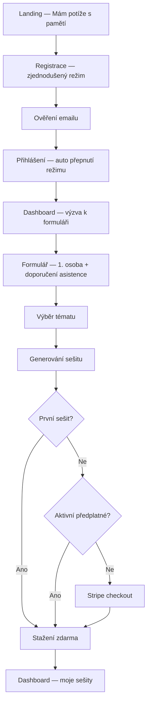
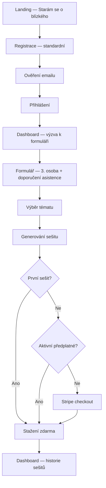
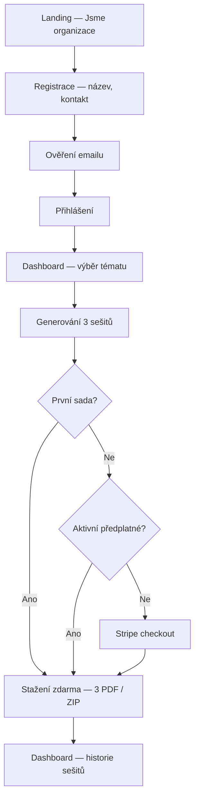
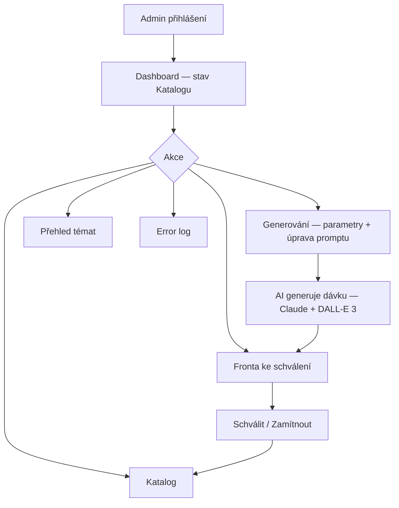
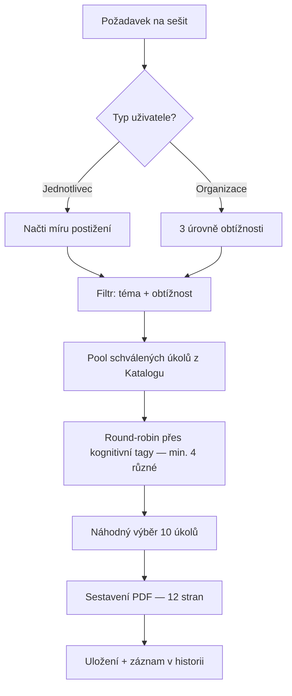

# Vlastním tempem — Product Architecture Blueprint (PAB v1)

## Metadata
- **Projekt:** Vlastním tempem
- **Organizace:** At Your Own Pace, z.s.
- **Verze:** v1
- **Datum:** 2026-04-04
- **Vstupní dokumenty:** PA_Vlastnim_tempem_v1.md, PAD_Vlastnim_tempem_v1.md
- **Status:** FINÁLNÍ (po Red Team review)

---

## KAPITOLA 1 — STRATEGICKÝ RÁMEC

### Problém
Pečující osoby (rodinní příslušníci i profesionální pečovatelé v institucích) nemají přístup ke strukturovaným, odstupňovaným materiálům pro kognitivní trénink. Dostupné zdroje jsou buď příliš odborné, nebo povrchní a bez jasné metodiky. Výsledkem je improvizace bez jistoty, že zvolený postup je adekvátní míře postižení klienta.

### Současný workaround
- **Domácí prostředí:** Pečující sami hledají materiály z různých zdrojů, kombinují je a přizpůsobují bez odborného vodítka.
- **Institucionální prostředí:** Pečovatelé používají generické, nerozlišené materiály (např. jedna nakopírovaná omalovánka pro všechny). Obsah není přizpůsoben individuální míře postižení — všichni dostávají totéž bez ohledu na své schopnosti.

### Aktéři

| Aktér | Popis |
|---|---|
| **Primární: Pečující osoba** | Vyhledává materiály, volí téma a obtížnost, používá sešit při práci s klientem. |
| **Primární: Osoba s kognitivním postižením** | Může web používat samostatně (lehčí postižení). Zjednodušený režim UI. |
| **Systémový: Admin** | Jeden člověk s psychologickým vzděláním. Schvaluje/zamítá AI-generované úkoly (human-in-the-loop). |

### Odpovědnost
Nezisková organizace At Your Own Pace, z.s.

### Hodnota
- Pečující získá důvěryhodný, strukturovaný materiál bez improvizace
- Klient dostane trénink přizpůsobený své míře postižení
- Posílení vztahu pečující–klient skrze společnou aktivitu
- Škálovatelnost do institucí (domovy, centra)

### Ztráta (bez řešení)
- Pokračující improvizace, nekonzistentní trénink
- Frustrace pečujících, pocit nejistoty
- Ztráta důstojnosti klienta při nevhodně zvolených úkolech
- Organizace nemá nástroj, jak svou misi škálovat

### Trigger ke změně
Demografické trendy (rostoucí počet osob s kognitivním postižením → rostoucí poptávka) + osobní zkušenost zakladatele organizace.

---

## KAPITOLA 2 — ARCHITEKTURA SYSTÉMU

### Core Job systému
Na základě uživatelského profilu (míra kognitivního postižení) a zvoleného tématu sestavit a doručit personalizovaný pracovní sešit (PDF) z předem schválených úkolů s pestrostí zaměření kognitivních funkcí.

### System Boundary

**Systém zahrnuje:**
- Webová aplikace (registrace, přihlášení, formulář, výběr tématu, stažení sešitu)
- Uživatelské účty (povinné — placená služba s freemium vstupem)
- Katalog úkolů (úložiště schválených úkolů se schvalovacím workflow)
- Admin rozhraní (dávkové generování úkolů přes AI, schvalování/zamítání/archivace, dashboard, přehled témat, error log)
- Generátor PDF sešitů (náhodný výběr + sestavení 12-stránkového PDF)
- Platební integrace: Stripe (testovací režim v MVP)
- Monetizační model: freemium (první sešit zdarma) + měsíční předplatné, dva tarify

**Systém nezahrnuje:**
- Klinickou diagnostiku
- Volbu zaměření úkolů uživatelem (budoucí fáze)
- Sledování pokroku klienta

### Source of Truth
- Míra postižení → odvozena z formuláře, uložena v profilu uživatele
- Kvalita obsahu → stav schválení úkolu adminem
- Obsah sešitu → Katalog schválených úkolů

### Core Entities

| Entita | Klíčové atributy | Vazby |
|---|---|---|
| Uživatel (jednotlivec) | email, heslo, role (osoba_s_postižením / pečující), profil, odpovědi z formuláře, míra postižení (lehká/střední/těžší) | → Sešit, → Předplatné |
| Uživatel (organizace) | email, heslo, název organizace, kontakt | → Sešit, → Předplatné |
| Úkol | textová část, grafická část (PNG 1024×1024), téma, obtížnost (3 stupně), kognitivní tagy, stav, datum generování, ID dávky | → Téma, → Generovací dávka |
| Téma | název (Rodina, Zahrada, Dům, Jaro...), popis, titulní obrázek | → Úkol |
| Sešit | téma, obtížnost, datum sestavení, seznam úkolů (vždy 10), PDF soubor | → Uživatel, → Úkol |
| Generovací dávka | parametry (téma, obtížnost, kognitivní funkce, počet, prompt text), datum, stav, AI model | → Úkol[] |
| Předplatné | typ (individuální/institucionální), stav (aktivní/neaktivní/expired/zrušené), datum začátku, datum konce, Stripe ID | → Uživatel |
| Katalog | kolekce schválených úkolů, filtrování per téma/obtížnost/tag | → Úkol |

### Stavový model — Úkol

```
Vygenerovaný → Ke schválení → Schválený → (Archivovaný)
                            → Zamítnutý
```

Pouze `Schválený` může vstoupit do sešitu.

### Rozhodovací body
1. Vyhodnocení formuláře → přiřazení míry postižení (lehká/střední/těžší)
2. Výběr úkolů do sešitu → filtr: míra + téma + diverzita kognitivních tagů (min. 4 různé)
3. Schválení úkolu adminem → vstup do Katalogu

### Logika vyhodnocení míry postižení

**Hodnocené dimenze (5):**

| # | Dimenze | Příklad |
|---|---|---|
| 1 | Paměť | Krátkodobá i dlouhodobá |
| 2 | Orientace | V čase a prostoru |
| 3 | Pozornost | Udržení soustředění, sekvenční úkoly |
| 4 | Jazyk | Porozumění, pojmenování |
| 5 | Samostatnost | Běžné denní úkony |

**Mapování:** Průměr 7 odpovědí (škála 1–3):

| Průměrný skór | Míra | Charakteristika |
|---|---|---|
| 1.0–1.6 | Lehká | Zvládá většinu aktivit s občasnou pomocí |
| 1.7–2.3 | Střední | Potřebuje pravidelnou asistenci, zjednodušené úkoly |
| 2.4–3.0 | Těžší | Potřebuje stálou podporu, velmi jednoduché úkoly |

**Upozornění na formuláři:** „Pokud je to možné, vyplňte tento formulář společně s blízkou osobou nebo pečovatelem. Pomůže to přesněji odhadnout vhodnou obtížnost cvičení."

### Invariants

| ID | Invariant |
|---|---|
| I1 | Sešit nesmí obsahovat úkol, který není ve stavu Schválený |
| I2 | Míra postižení musí být vyhodnocena před sestavením sešitu (pouze jednotlivec) |
| I3 | Každý úkol musí mít přiřazené téma, obtížnost a kognitivní tagy |
| I4 | Sešit musí obsahovat úkoly s min. 4 různými kognitivními tagy |
| I5 | Uživatel musí mít platný účet pro stažení sešitu |
| I6 | Aktivní předplatné je podmínkou pro generování 2. a dalšího sešitu |
| I7 | Organizace neprochází formulářem — vždy dostává 3 sešity (jeden per stupeň) |
| I8 | Téma je dostupné pokud má min. 10 schválených úkolů s min. 4 různými kognitivními tagy per obtížnost |
| I9 | Sešit obsahuje vždy přesně 10 úkolů |
| I10 | Každý úkol musí mít přiřazen alespoň jeden kognitivní tag |
| I11 | Formulář pokrývá všech 5 dimenzí (7 otázek) |

### Hlavní workflow — Jednotlivec
1. Registrace (volba role: osoba s postižením / pečující)
2. Ověření emailu
3. Přihlášení (systém automaticky přepne režim dle role)
4. Vyplnění formuláře (znění dle role: 1. osoba / 3. osoba)
5. Výběr tématu
6. Generování sešitu (1 PDF, 12 stran)
7. Stažení (první zdarma, další = předplatné)

### Hlavní workflow — Organizace
1. Registrace (název, kontakt)
2. Ověření emailu
3. Přihlášení
4. Výběr tématu
5. Generování 3 sešitů (lehká/střední/těžší)
6. Stažení (první sada zdarma, další = předplatné)

### Admin workflow
1. Zadání parametrů generování (téma, obtížnost, kognitivní funkce, počet, prompt)
2. Admin vidí a může upravit prompt před odesláním
3. Systém dávkově zavolá Claude API (text) + DALL-E 3 (grafika, s kulturním kontextem v promptu)
4. Úkoly spadnou do fronty ke schválení
5. Admin schvaluje / zamítá (text + grafika)
6. Schválené → Katalog

### Admin rozhraní — funkční oblasti
1. **Generování úkolů** — parametry, úprava promptu, spuštění dávky
2. **Fronta ke schválení** — review, filtrování, schválení/zamítnutí
3. **Katalog** — prohlížení, filtrování, archivace schválených úkolů
4. **Dashboard** — matice téma × obtížnost, statistiky, indikace dostatku/nedostatku
5. **Přehled témat** — naplněnost, dostupnost na frontendu
6. **Error log** — selhání AI generování, retry

### AI stack
- **Text:** Claude API (Anthropic)
- **Grafika:** DALL-E 3 (OpenAI API) — PNG 1024×1024, prompt musí obsahovat kulturní kontext („Central European setting", „Czech traditional [topic]")
- Obojí jako API, dávkové volání

### PDF sešit — struktura

| Strana | Obsah |
|---|---|
| 1 | Titulní — obrázek k tématu + „Vlastním tempem — Pracovní sešit" + téma + míra obtížnosti |
| 2–11 | Úkoly — jedna strana = jeden úkol (textová + grafická část) |
| 12 | Instrukce pro pečující — jak sešit používat, doporučený postup, kontakt na organizaci |

Formát: A4 na výšku, PDF, UTF-8.

### Co systém nikdy nebude dělat
- Stanovovat klinickou diagnózu
- Generovat úkoly v reálném čase na žádost uživatele
- Umožňovat uživateli volit zaměření úkolů (budoucí fáze)
- Sledovat a vyhodnocovat pokrok klienta

---

## KAPITOLA 2.5 — INTERAKČNÍ KONTRAKTY

### UC1: Registrace jednotlivce
- **Aktér:** Pečující osoba / Osoba s postižením
- **Vstup:** email, heslo, role (osoba_s_postižením / pečující)
- **Výstup:** Vytvořený účet typu „jednotlivec" s rolí
- **Validace:** Unikátní email, validní formát, síla hesla
- **Chybové stavy:** Duplicitní email, nevalidní vstup
- **Side effects:** Ověřovací email

### UC2: Registrace organizace
- **Aktér:** Zástupce instituce
- **Vstup:** email, heslo, název organizace, kontakt
- **Výstup:** Vytvořený účet typu „organizace"
- **Validace:** Unikátní email, validní formát, vyplněný název a kontakt
- **Chybové stavy:** Duplicitní email, chybějící povinná pole
- **Side effects:** Ověřovací email

### UC3: Přihlášení
- **Aktér:** Uživatel (všechny typy)
- **Vstup:** email, heslo
- **Výstup:** Autentizovaná session, automatický přepnutí režimu dle role
- **Validace:** Existující účet, správné heslo, ověřený email
- **Chybové stavy:** Nesprávné údaje, neověřený email

### UC4: Vyplnění / editace formuláře míry postižení
- **Aktér:** Jednotlivec (oba role)
- **Vstup:** Odpovědi na 7 otázek (5 dimenzí, škála 1–3), znění dle role
- **Výstup:** Vyhodnocená míra postižení, uložená v profilu
- **Validace:** Všechny otázky zodpovězeny
- **Chybové stavy:** Neúplné odpovědi
- **Side effects:** Aktualizace profilu (poslední stav přepisuje)
- **Entry points:** Nové vyplnění (z dashboardu) / editace (tlačítko „Upravit" → předvyplněné odpovědi → nový výsledek + upozornění o aktualizaci)

### UC5: Výběr tématu a stažení sešitu (jednotlivec)
- **Aktér:** Jednotlivec
- **Vstup:** Zvolené téma
- **Výstup:** PDF sešit (12 stran: titulní + 10 úkolů + instrukce)
- **Validace:** Vyhodnocená míra (I2), dostatek úkolů (I8). Pro 2.+ sešit: aktivní předplatné (I6)
- **Chybové stavy:** Nevyplněný formulář, nedostatek úkolů, neaktivní předplatné (po free sešitu)
- **Side effects:** Sešit uložen v historii

### UC6: Výběr tématu a stažení sešitů (organizace)
- **Aktér:** Organizace
- **Vstup:** Zvolené téma
- **Výstup:** 3 PDF sešity (lehká/střední/těžší, každý 12 stran)
- **Validace:** Dostatek úkolů pro všechny 3 stupně (I8). Pro 2.+ sadu: aktivní předplatné (I6)
- **Chybové stavy:** Nedostatek úkolů, neaktivní předplatné
- **Side effects:** Sešity uloženy v historii

### UC7: Aktivace předplatného
- **Aktér:** Uživatel (všechny typy)
- **Vstup:** Výběr tarifu, platební údaje (Stripe)
- **Výstup:** Aktivní předplatné
- **Validace:** Validní platební metoda
- **Chybové stavy:** Zamítnutá platba, chyba Stripe API
- **Side effects:** Stripe subscription

### UC8: Dávkové generování úkolů
- **Aktér:** Admin
- **Vstup:** Téma, obtížnost, kognitivní funkce, počet, prompt (admin vidí a může upravit)
- **Výstup:** Dávka úkolů (text + grafika PNG) ve stavu „Ke schválení"
- **Validace:** Platné parametry, počet > 0
- **Chybové stavy:** Selhání Claude API, selhání DALL-E 3, částečné selhání → error log
- **Side effects:** Úkoly uloženy, dávka zalogována

### UC9: Schválení / zamítnutí úkolu
- **Aktér:** Admin
- **Vstup:** ID úkolu, rozhodnutí
- **Výstup:** Aktualizovaný stav
- **Validace:** Stav „Ke schválení"
- **Chybové stavy:** Nesprávný stav
- **Side effects:** Schválený → dostupný pro sešity

### UC10: Archivace úkolu
- **Aktér:** Admin
- **Vstup:** ID schváleného úkolu
- **Výstup:** Stav → Archivovaný
- **Validace:** Stav „Schválený"
- **Side effects:** Nedostupný pro nové sešity (existující neovlivněny)

### UC11: Historie a opakované stažení
- **Aktér:** Uživatel (přihlášený, bez ohledu na předplatné)
- **Výstup:** Seznam sešitů + stažení
- **Organizace:** 3 tlačítka per míra + ZIP

### UC12: Zrušení předplatného
- **Aktér:** Uživatel
- **Výstup:** Předplatné aktivní do konce období, pak neaktivní
- **Side effects:** Stripe cancel

### UC13–UC16: Admin obrazovky
- UC13: Fronta ke schválení (filtry, náhled, akce)
- UC14: Katalog (filtry, archivace, upozornění při poklesu pod I8)
- UC15: Dashboard (matice, statistiky, rychlé akce)
- UC16: Přehled témat (naplněnost, dostupnost, odkaz na generování)

---

## KAPITOLA 3 — ROZSAH A PRIORITY

### Co je v MVP

| # | Funkce | Priorita |
|---|---|---|
| 1 | Admin workflow (generování s úpravou promptu, schvalování, Katalog, dashboard, přehled témat, error log) | P0 |
| 2 | Generátor PDF sešitů (12 stran: titulní + 10 úkolů + instrukce, A4) | P0 |
| 3 | Registrace + přihlášení (3 cesty: osoba s postižením / pečující / organizace) | P0 |
| 4 | Ověření emailu | P0 |
| 5 | Formulář míry postižení (2 znění, 7 otázek, editovatelný) | P0 |
| 6 | Výběr tématu + stažení (jednotlivec 1 PDF, organizace 3 PDF + ZIP) | P0 |
| 7 | Freemium — první sešit/sada zdarma | P0 |
| 8 | Stripe platba (testovací režim), dva tarify, měsíční předplatné | P1 |
| 9 | Historie sešitů + opakované stažení (i po expiraci předplatného) | P1 |
| 10 | Self-service zrušení předplatného | P1 |
| 11 | Zjednodušený režim — CSS přepínač (větší fonty, méně barev, větší klikací plochy) | P1 |
| 12 | Automatická dostupnost témat (I8) | P2 |

### Co není v MVP

| # | Funkce | Důvod |
|---|---|---|
| 1 | Volba zaměření úkolů uživatelem | Explicitně odloženo |
| 2 | Sledování pokroku klienta | Mimo boundary |
| 3 | Správa klientských profilů pod organizací | Organizace = jeden profil |
| 4 | Stripe produkční režim | Testovací v MVP |
| 5 | Roční předplatné | Měsíční, dva tarify |
| 6 | Reset hesla | Textové vysvětlení v UI |
| 7 | Editace obsahu úkolů adminem | Schvaluje/zamítá celek |

### Zjednodušení v MVP

| Plná vize | MVP |
|---|---|
| Uživatel volí téma i zaměření | Pouze téma |
| Stripe produkční | Stripe testovací |
| Organizace spravuje klienty | Jeden účet, 3 sešity per téma |
| Dva frontendové layouty | Jeden layout + CSS přepínač |
| Sofistikovaný algoritmus pestrosti | Round-robin přes kognitivní tagy |

---

## KAPITOLA 4 — MAPA TOKŮ

### User Flow — Osoba s postižením



### User Flow — Pečující osoba



### User Flow — Organizace



### Admin Flow



### Tok sestavení sešitu



### Bottlenecky
- Admin = single point of failure (schvalování obsahu)
- AI kvalita ovlivňuje zátěž admina

### Neviditelné závislosti
- Dostupnost témat závisí na aktivitě admina
- Organizace potřebuje dostatek úkolů pro všechny 3 stupně (přísnější I8)

---

## KAPITOLA 5 — MVP LOGISTIKA

### Pilotní skupina

| Skupina | Počet |
|---|---|
| Jednotlivci (pečující + osoby s postižením) | 10–15 |
| Organizace | 2–3 |
| Admin | 1 |

### Rozsah dat

| Dimenze | Rozsah |
|---|---|
| Témata | 3–5 (Rodina, Zahrada, Dům, Jaro, Domácí práce) |
| Obtížnosti | 3 (lehká / střední / těžší) |
| Úkolů per téma per obtížnost | min. 20 schválených |
| Celkem v Katalogu | 180–300 schválených úkolů |
| Kognitivní tagy | 4–6 (paměť, pozornost, orientace, logické myšlení, jazykové dovednosti, vizuální vnímání) |

### Časový rámec

| Fáze | Délka |
|---|---|
| Příprava Katalogu | 2–4 týdny |
| Technický pilot | 2 týdny |
| Pilotní provoz | 4–6 týdnů |
| Vyhodnocení | 1 týden |
| **Celkem** | **9–13 týdnů** |

### KPI

| # | KPI | Cíl |
|---|---|---|
| 1 | Míra dokončení registrace | ≥ 80 % |
| 2 | Stažené sešity per uživatel/měsíc | ≥ 2 |
| 3 | Míra schválení úkolů adminem | ≥ 60 % |
| 4 | Dostupnost pilotních témat | 100 % pro všechny obtížnosti |
| 5 | Spokojenost pilotních uživatelů | ≥ 4/5 |

---

## KAPITOLA 6 — RIZIKA

### Technická rizika

| # | Riziko | P | D | Mitigace |
|---|---|---|---|---|
| T1 | Kvalita AI textu (nesrozumitelné, špatná obtížnost) | Střední | Vysoký | Iterace promptů, A/B testování |
| T2 | Kvalita DALL-E grafiky (nevhodný styl) | Střední | Vysoký | Style guide, fallback: vlastní grafika |
| T3 | Selhání API (Claude / DALL-E / Stripe) | Nízká | Střední | Retry, graceful errors |
| T4 | PDF generátor nezvládá text + grafiku | Nízká | Vysoký | Prototyp jako první spike |
| T5 | AI grafika neodpovídá českému kulturnímu kontextu | Střední | Střední | Kulturní kontext v promptu, admin validace |

### Behaviorální rizika

| # | Riziko | P | D | Mitigace |
|---|---|---|---|---|
| B1 | Nízká konverze registrace + formuláře | Střední | Vysoký | KPI #1, minimalizace kroků |
| B2 | Neporozumění formuláři | Střední | Vysoký | Testování s pilotní skupinou, nápovědy |
| B3 | Organizace nestahují / nepoužívají | Střední | Nízký | KPI #2 |
| B4 | Očekávání více obsahu | Střední | Střední | Transparentní komunikace |
| B5 | Freemium zneužití (opakované free účty) | Nízká | Nízký | Akceptováno pro MVP, v budoucnu rate-limiting |

### Concurrency, integrita, závislosti

| # | Riziko | Mitigace |
|---|---|---|
| C1 | Identické sešity | Seed per request |
| C2 | Schvalování vs. generování | Stavový model |
| D1 | Archivace úkolu v sešitu | Sešit = snapshot |
| D3 | Stripe webhook selhání | Retry, reconciliation |
| E1 | Admin SPOF | Akceptováno pro MVP |
| E2–E4 | API závislosti | Fallback: manuální práce |

---

## UI/UX DESIGN

### Principy zjednodušeného režimu
Aktivuje se automaticky pro role „osoba s postižením". Implementace: CSS třída `simplified-mode`.
- Větší fonty, méně barev, větší klikací plochy (min. 48×48px)
- Stejný layout jako standardní režim
- Jednodušší formulace textů

### Formulář míry postižení — dvě znění

**Varianta A — Osoba s postižením (1. osoba):**

Úvodní text: „Je dobré vyplnit to s někým blízkým."

Q1 — Paměť: „Pamatujete si, co jste dnes dělal/a nebo jedl/a?"
- (1) Většinou ano / (2) Někdy si nejsem jistý/á / (3) Většinou ne

Q2 — Paměť: „Poznáváte lidi kolem sebe — rodinu, přátele?"
- (1) Poznám všechny / (2) Někdy si nejsem jistý/á / (3) Často nepoznávám

Q3 — Orientace: „Víte, jaký je den a kde se nacházíte?"
- (1) Ano, vím / (2) Někdy si nejsem jistý/á / (3) Často nevím

Q4 — Pozornost: „Vydržíte se soustředit na jednu věc — třeba prohlížet knihu nebo skládat puzzle?"
- (1) Ano, delší dobu / (2) Chvíli ano, pak mě to unaví / (3) Je to pro mě hodně těžké

Q5 — Pozornost: „Zvládnete udělat něco, co má víc kroků — třeba uvařit čaj?"
- (1) Většinou ano / (2) Potřebuji, aby mi někdo pomohl / (3) Nezvládám to

Q6 — Jazyk: „Jak se vám daří mluvit a rozumět druhým?"
- (1) Mluvím bez problémů / (2) Někdy hledám slova nebo nerozumím / (3) Mluvení je pro mě hodně těžké

Q7 — Samostatnost: „Kolik pomoci potřebujete přes den — s oblékáním, jídlem, hygienou?"
- (1) Zvládám většinu sám/sama / (2) Potřebuji pravidelnou pomoc / (3) Potřebuji pomoc téměř se vším

**Varianta B — Pečující osoba (3. osoba):**

Úvodní text: „Pokud je to možné, vyplňte tento formulář společně s blízkou osobou nebo pečovatelem. Pomůže to přesněji odhadnout vhodnou obtížnost cvičení."

Q1 — Paměť: „Jak si váš blízký pamatuje nedávné události (co jedl, kdo přišel na návštěvu)?"
- (1) Většinou si vzpomene, občas potřebuje nápovědu / (2) Vzpomíná si jen na některé věci / (3) Nepamatuje si téměř nic

Q2 — Paměť: „Pozná váš blízký své blízké osoby (rodinu, přátele)?"
- (1) Pozná všechny / (2) Někdy si není jistý / (3) Často nepoznává

Q3 — Orientace: „Jak se váš blízký orientuje v čase a prostoru?"
- (1) Ví, jaký je den a kde se nachází / (2) Občas si není jistý / (3) Často neví

Q4 — Pozornost: „Jak dlouho se váš blízký dokáže soustředit na jednu činnost?"
- (1) 15 a více minut / (2) 5–15 minut / (3) Jen pár minut nebo nedokáže začít

Q5 — Pozornost: „Dokáže váš blízký dokončit jednoduchý úkol s více kroky (např. připravit čaj)?"
- (1) Většinu kroků zvládne / (2) Potřebuje vedení / (3) Nedokáže ani s pomocí

Q6 — Jazyk: „Jak váš blízký komunikuje?"
- (1) Mluví plynule / (2) Hledá slova, někdy nerozumí / (3) Jen jednotlivá slova nebo velmi obtížně

Q7 — Samostatnost: „Kolik pomoci váš blízký potřebuje při běžných denních činnostech?"
- (1) Většinu zvládne sám / (2) Pravidelná asistence / (3) Stálá pomoc téměř u všeho

**Vyhodnocení:** Průměr → 1.0–1.6 Lehká / 1.7–2.3 Střední / 2.4–3.0 Těžší

### Souhrn obrazovek

| # | Obrazovka | Režim |
|---|---|---|
| 1 | Landing page | Univerzální — 3 karty (osoba s postižením / pečující / organizace) |
| 2 | Registrace | 3 záložky s přizpůsobeným formulářem |
| 3 | Ověření emailu | Standardní + zjednodušený text |
| 4 | Přihlášení | Univerzální (auto-režim po přihlášení) |
| 5 | Dashboard — Osoba s postižením | Zjednodušený (CSS) — velké karty, minimální prvky |
| 6 | Dashboard — Pečující | Standardní — formulář, témata, historie |
| 7 | Dashboard — Organizace | Standardní — profil, témata, historie (3 PDF + ZIP) |
| 8 | Formulář míry postižení | 2 znění × 2 vizuální režimy |
| 9 | Generování a stažení | Standardní + zjednodušený |
| 10 | Předplatné (Stripe) | Standardní + zjednodušený |
| 11 | Admin Dashboard | Matice, statistiky, rychlé akce |
| 12 | Admin Generování | Parametry, úprava promptu, dávky |
| 13 | Admin Fronta | Review, filtry, schválení/zamítnutí |
| 14 | Admin Katalog | Prohlížení, filtrování, archivace |
| 15 | Admin Přehled témat | Naplněnost, dostupnost |
| 16 | Admin Error log | Selhání, retry |

**Celkem: 16 obrazovek** (10 uživatelských + 6 admin)

Detailní specifikace každé obrazovky (účel, UI komponenty, akce, states, data bindings) viz PAD_Vlastnim_tempem_v1.md.

---

## SOUHRNNÝ PŘEHLED ASSUMPTIONS

| ID | Assumption |
|---|---|
| A1 | Pečující osoba je ochotna vyplnit formulář |
| A2 | Admin (1 osoba) zvládne schvalovat obsah pro MVP |
| A3 | Instituce mají zájem o PDF sešity |
| A4 | Třístupňová škála je dostatečná |
| A5 | Témata = životní kontext, ne kognitivní funkce |
| A6 | Kognitivní tagy jsou interní klasifikace |
| A7 | Dávkové AI generování je součástí admin rozhraní |
| A8 | Registrace je povinná |
| A9 | Dva tarify v MVP |
| A10 | Stripe test → produkce = konfigurační změna |
| A11 | Organizace nespravuje klienty |
| A12 | Volba kognitivní funkce pro organizaci mimo MVP |
| A13 | Formulář — žádná historie, platí poslední stav |
| A14 | Sešit je neměnný po vygenerování |
| A15 | Kognitivní tagy definuje admin |
| A16 | 10 úkolů je dostatečný rozsah |
| A17 | Admin needituje obsah úkolů |
| A18 | Bottleneck admina akceptovatelný pro MVP |
| A19 | Částečné selhání AI — úspěšné úkoly se uloží |
| A20 | DALL-E 3 zvládá jednoduché ilustrace |
| A21 | Organizace má přístup k pilotní skupině |
| A22 | Admin naplní Katalog za 2–4 týdny |
| A23 | 3–5 témat pro validaci |
| A24 | Výpadky API krátkodobé |
| A25 | Admin reaguje na nízkou míru schválení |
| A26 | 5 dimenzí pokrývá spektrum |
| A27 | Škála 1–3 dostatečně granulární |
| A28 | Prahové hodnoty validovány s psychologem |
| A29 | Zjednodušený režim dostatečný pro lehčí postižení |

## SOUHRNNÝ DECISION LOG

| ID | Rozhodnutí |
|---|---|
| D1 | Primární aktéři = pečující + osoba s postižením (oba přímý přístup) |
| D2 | Instituce v cílovce MVP |
| D3 | Admin = jednotlivec s psychologickým backgroundem |
| D4 | Téma = životní kontext |
| D5 | Sešit = náhodný výběr s diverzitou tagů |
| D6 | AI generování = dávka uvnitř systému |
| D7 | Volba zaměření uživatelem mimo MVP |
| D8 | Freemium (1. sešit zdarma) + měsíční předplatné, dva tarify |
| D9 | Stripe testovací |
| D10 | 3 UX cesty (osoba s postižením / pečující / organizace), 2 typy účtů |
| D11 | Organizace = zjednodušený profil |
| D12 | Organizace = 3 sešity per téma |
| D13 | Témata vznikají implicitně |
| D14 | Dostupnost tématu automatická |
| D15 | Sešity perzistentní |
| D16 | Zrušení self-service |
| D17 | Historie dostupná i po expiraci |
| D18 | Sešit = 10 úkolů |
| D19 | Algoritmus maximalizuje diverzitu tagů |
| D20 | Kognitivní tag povinné metadata |
| D21 | Chybějící funkce = textové vysvětlení |
| D22 | Ověření emailu v MVP |
| D23 | Dva user journey sdílejí generátor |
| D24 | Sestavení plně automatické |
| D25 | AI stack = Claude API + DALL-E 3 |
| D26 | Katalog = úložiště schválených úkolů |
| D27 | Admin = 6 funkčních oblastí |
| D28 | Grafika = PNG 1024×1024 |
| D29 | Pilot = 3–5 témat, 20 úkolů per téma per obtížnost |
| D30 | 4–6 kognitivních tagů |
| D31 | Pilot = 9–13 týdnů |
| D32 | Největší riziko = kvalita AI |
| D33 | Admin = akceptovaný SPOF |
| D34 | Fallback = manuální práce |
| D35 | 5 dimenzí hodnocení |
| D36 | Prahy 1.7 / 2.4 |
| D37 | Znění formuláře v scope PAD |
| D38 | Zjednodušený režim = CSS přepínač (větší fonty, méně barev) |
| D39 | Formulář ve dvou zněních |
| D40 | PDF = 12 stran (titulní + 10 úkolů + instrukce), A4 |
| D41 | Admin vidí a může upravit AI prompt |
| D42 | DALL-E prompt musí obsahovat český kulturní kontext |
| D43 | I8 = min. 10 úkolů + min. 4 různé kognitivní tagy |

---

## RED TEAM REVIEW — ZÁVĚR

**Status:** FINÁLNÍ

**Structural Check:** Všechny dimenze prověřeny (boundary, state model, concurrency, trust, MVP scope, invariants) — bez nalezených problémů.

**Největší zbývající riziko:** T1 + T2 (kvalita AI výstupů) — validovatelné až v přípravné fázi pilotu. Mitigace: iterace promptů, kulturní kontext, style guide, human-in-the-loop schvalování.
