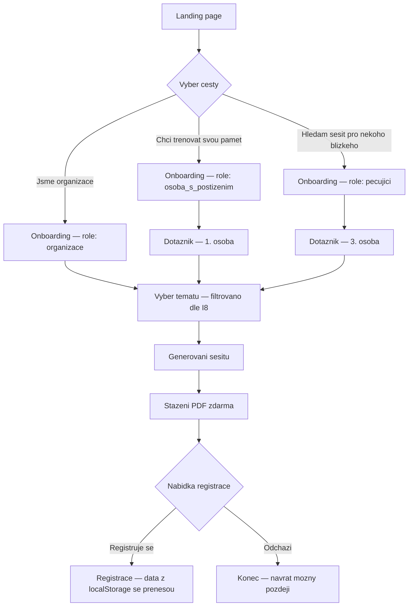
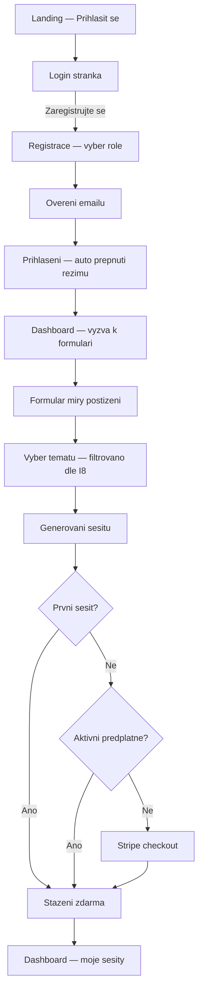
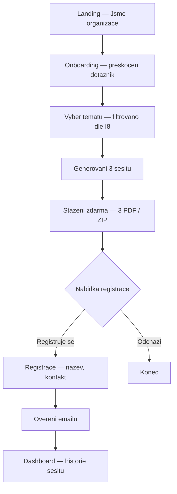
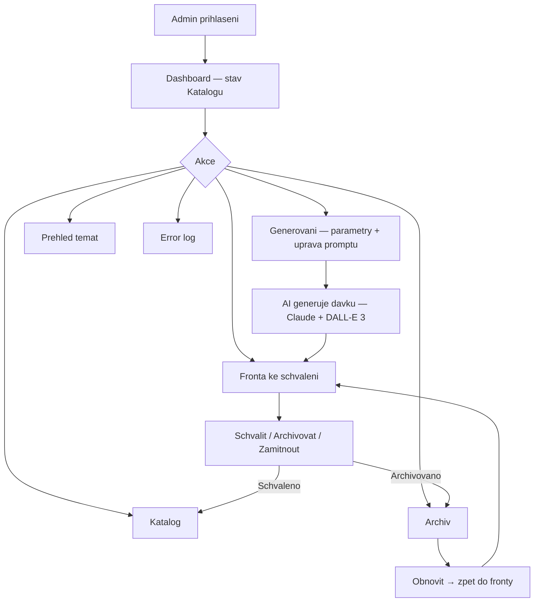
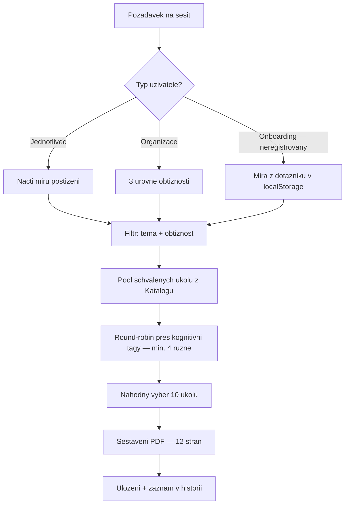

# Vlastnim tempem — Product Architecture Blueprint (PAB v3)

## Metadata
- **Projekt:** Vlastnim tempem
- **Organizace:** At Your Own Pace, z.s.
- **Verze:** v3
- **Datum:** 2026-04-04
- **Vstupni dokumenty:** PA_Vlastnim_tempem_v1.md, PAD_Vlastnim_tempem_v1.md, BACKLOG.md (BL-001 az BL-011)
- **Status:** IMPLEMENTOVANO (MVP + UX Redesign)
- **Predchozi verze:** PAB_Vlastnim_tempem_v2.md

---

## KAPITOLA 1 — STRATEGICKY RAMEC

### Problem
Pecujici osoby (rodinni prislusnici i profesionalni pecovatele v institucich) nemaji pristup ke strukturovanym, odstupnovanym materialam pro kognitivni trenink. Dostupne zdroje jsou bud prilis odborne, nebo povrchni a bez jasne metodiky. Vysledkem je improvizace bez jistoty, ze zvoleny postup je adekvatni mire postizeni klienta.

### Soucasny workaround
- **Domaci prostredi:** Pecujici sami hledaji materialy z ruznych zdroju, kombinuji je a prizpusobuji bez odborneho voditka.
- **Institucionalni prostredi:** Pecovatele pouzivaji genericke, nerozlisene materialy (napr. jedna nakopirovna omalovanka pro vsechny). Obsah neni prizpusoben individualni mire postizeni — vsichni dostavaji totez bez ohledu na sve schopnosti.

### Akteri

| Akter | Popis |
|---|---|
| **Primarni: Pecujici osoba** | Vyhledava materialy, voli tema a obtiznost, pouziva sesit pri praci s klientem. |
| **Primarni: Osoba s kognitivnim postizenim** | Muze web pouzivat samostatne (lehci postizeni). Zjednoduseny rezim UI + a11y tema. [ZMENA v3: pridano a11y tema] |
| **Systemovy: Admin** | Jeden clovek s psychologickym vzdelanim. Schvaluje/zamita AI-generovane ukoly (human-in-the-loop). |

### Odpovednost
Neziskova organizace At Your Own Pace, z.s.

### Hodnota
- Pecujici ziska duveryhodny, strukturovany material bez improvizace
- Klient dostane trenink prizpusobeny sve mire postizeni
- Posileni vztahu pecujici–klient skrze spolecnou aktivitu
- Skalovatelnost do instituci (domovy, centra)

### Ztrata (bez reseni)
- Pokracujici improvizace, nekonzistentni trenink
- Frustrace pecujicich, pocit nejistoty
- Ztrata dustojnosti klienta pri nevhodne zvolenych ukolech
- Organizace nema nastroj, jak svou misi skalovat

### Trigger ke zmene
Demograficke trendy (rostouci pocet osob s kognitivnim postizenim → rostouci poptavka) + osobni zkusenost zakladatele organizace.

---

## KAPITOLA 2 — ARCHITEKTURA SYSTEMU

### Core Job systemu
Na zaklade uzivatelskeho profilu (mira kognitivniho postizeni) a zvoleneho tematu sestavit a dorucit personalizovany pracovni sesit (PDF) z predem schvalenych ukolu s pestrosti zamereni kognitivnich funkci.

### System Boundary

**System zahrnuje:**
- Webova aplikace (onboarding, registrace, prihlaseni, formular, vyber tematu, stazeni sesitu)
- Uzivatelske ucty (povinna pro 2.+ sesit — placena sluzba s freemium vstupem) [ZMENA v2: prvni sesit dostupny bez registrace, viz BL-001]
- Katalog ukolu (uloziste schvalenych ukolu se schvalovacim workflow)
- Admin rozhrani (davkove generovani ukolu pres AI, schvalovani/zamitani/archivace, dashboard, prehled temat, archiv, error log) [ZMENA v2: pridana archivni sekce, viz BL-002]
- Generator PDF sesitu (nahodny vyber + sestaveni 12-strankoveho PDF)
- Platebni integrace: Stripe (testovaci rezim v MVP)
- Monetizacni model: freemium (prvni sesit zdarma bez registrace) + mesicni predplatne, dva tarify [ZMENA v2: prvni sesit bez uctu, viz BL-001]

**System nezahrnuje:**
- Klinickou diagnostiku
- Volbu zamereni ukolu uzivatelem (budouci faze)
- Sledovani pokroku klienta

### Tech Stack [ZMENA v2: pridana sekce]

| Komponenta | Technologie |
|---|---|
| Framework | Next.js 16 App Router (TypeScript) |
| Styling | Tailwind CSS v4, shadcn/ui |
| Autentizace a DB | Supabase (Auth, Postgres, Storage) |
| Platby | Stripe (testovaci rezim) |
| PDF generovani | @react-pdf/renderer (server-side via API route) |
| AI text | Claude API (Anthropic) |
| AI grafika | DALL-E 3 (OpenAI API) |
| Font | Nunito (Google Fonts) — zaobleny, pratelsky sans-serif [NOVE v3: viz BL-010] |
| Deployment | Vercel |

**Implementacni poznamky:**
- PDF: 12-strankovy A4 dokument, font Roboto (podpora ceske diakritiky), generovany server-side pres API route
- Databazovy trigger pouziva `SECURITY DEFINER SET search_path = public`
- AI klienti pouzivaji lazy inicializaci (nikoliv pri importu modulu) — prevence chyb pri buildu
- Route groups: `(auth)`, `(dashboard)`, `(admin)`

### Source of Truth
- Mira postizeni → odvozena z formulare, ulozena v profilu uzivatele (nebo v localStorage pred registraci) [ZMENA v2: localStorage pro onboarding, viz BL-001/BL-006]
- Kvalita obsahu → stav schvaleni ukolu adminem
- Obsah sesitu → Katalog schvalenych ukolu

### Core Entities

| Entita | Klicove atributy | Vazby |
|---|---|---|
| Uzivatel (jednotlivec) | email, heslo, role (osoba_s_postizenim / pecujici), profil, odpovedi z formulare, mira postizeni (lehka/stredni/tezsi) | → Sesit, → Predplatne |
| Uzivatel (organizace) | email, heslo, nazev organizace, kontakt | → Sesit, → Predplatne |
| Ukol | textova cast, graficka cast (PNG 1024x1024), tema, obtiznost (3 stupne), kognitivni tagy, stav, datum generovani, ID davky | → Tema, → Generovaci davka |
| Tema | nazev (Rodina, Zahrada, Dum, Jaro...), popis, titulni obrazek | → Ukol |
| Sesit | tema, obtiznost, datum sestaveni, seznam ukolu (vzdy 10), PDF soubor | → Uzivatel, → Ukol |
| Generovaci davka | parametry (tema, obtiznost, kognitivni funkce, pocet, prompt text), datum, stav, AI model | → Ukol[] |
| Predplatne | typ (individualni/institucionalni), stav (aktivni/neaktivni/expired/zrusene), datum zacatku, datum konce, Stripe ID | → Uzivatel |
| Katalog | kolekce schvalenych ukolu, filtrovani per tema/obtiznost/tag | → Ukol |

### Stavovy model — Ukol [ZMENA v2: rozsireno o prechod z Archivovany zpet do Ke schvaleni, viz BL-002]

```
Vygenerovany → Ke schvaleni → Schvaleny → (Archivovany)
                            → Zamitnuty
                            → Archivovany (primo z fronty) [ZMENA v2: viz BL-003]

Archivovany → Ke schvaleni (obnoveni) [ZMENA v2: viz BL-002]
```

Stavove prechody:
- `Vygenerovany → Ke schvaleni` — automaticky po uspesnem AI generovani
- `Ke schvaleni → Schvaleny` — admin schvali
- `Ke schvaleni → Zamitnuty` — admin zamitne
- `Ke schvaleni → Archivovany` — admin archivuje primo z fronty [ZMENA v2: viz BL-003]
- `Schvaleny → Archivovany` — admin archivuje z Katalogu
- `Archivovany → Ke schvaleni` — admin obnovi z Archivu [ZMENA v2: viz BL-002]

Pouze `Schvaleny` muze vstoupit do sesitu.

### Rozhodovaci body
1. Vyhodnoceni formulare → prirazeni miry postizeni (lehka/stredni/tezsi)
2. Vyber ukolu do sesitu → filtr: mira + tema + diverzita kognitivnich tagu (min. 4 ruzne)
3. Schvaleni ukolu adminem → vstup do Katalogu

### Logika vyhodnoceni miry postizeni

**Hodnocene dimenze (5):**

| # | Dimenze | Priklad |
|---|---|---|
| 1 | Pamet | Kratkodoba i dlouhodoba |
| 2 | Orientace | V case a prostoru |
| 3 | Pozornost | Udrzeni soustredeni, sekvencni ukoly |
| 4 | Jazyk | Porozumeni, pojmenovani |
| 5 | Samostatnost | Bezne denni ukony |

**Mapovani:** Prumer 7 odpovedi (skala 1–3):

| Prumerny skor | Mira | Charakteristika |
|---|---|---|
| 1.0–1.6 | Lehka | Zvlada vetsinu aktivit s obcasnou pomoci |
| 1.7–2.3 | Stredni | Potrebuje pravidelnou asistenci, zjednodusene ukoly |
| 2.4–3.0 | Tezsi | Potrebuje stalou podporu, velmi jednoduche ukoly |

**Upozorneni na formulari:** „Pokud je to mozne, vyplnte tento formular spolecne s blizkou osobou nebo pecovatelem. Pomuze to presneji odhadnout vhodnou obtiznost cviceni."

### Invariants

| ID | Invariant |
|---|---|
| I1 | Sesit nesmi obsahovat ukol, ktery neni ve stavu Schvaleny |
| I2 | Mira postizeni musi byt vyhodnocena pred sestavenim sesitu (pouze jednotlivec) |
| I3 | Kazdy ukol musi mit prirazene tema, obtiznost a kognitivni tagy |
| I4 | Sesit musi obsahovat ukoly s min. 4 ruznymi kognitivnimi tagy |
| I5 | Uzivatel musi mit platny ucet pro stazeni sesitu — **relaxovano pro prvni sesit** (prvni sesit dostupny bez registrace) [ZMENA v2: viz BL-001] |
| I6 | Aktivni predplatne je podminkou pro generovani 2. a dalsiho sesitu |
| I7 | Organizace neprochazi formularem — vzdy dostava 3 sesity (jeden per stupen) |
| I8 | Tema je dostupne pokud ma min. 10 schvalenych ukolu s min. 4 ruznymi kognitivnimi tagy per obtiznost. Kontrola se uplatnuje i v onboarding wizardu — nedostupna temata zobrazuji stitek "Pripravujeme" a jsou neklikatelna. [ZMENA v2: viz BL-008] |
| I9 | Sesit obsahuje vzdy presne 10 ukolu |
| I10 | Kazdy ukol musi mit prirazen alespon jeden kognitivni tag |
| I11 | Formular pokryva vsech 5 dimenzi (7 otazek) |

### Hlavni workflow — Jednotlivec [ZMENA v2: onboarding-first flow, viz BL-001/BL-006]

**Flow A: Onboarding first (doporuceny — tlacitka "Zacit" na landing page)**
1. Uzivatel klikne "Zacit" na landing page → vstoupi do onboarding pruvodce (bez registrace)
2. Krok 1: Vyber role (osoba s postizenim / pecujici / organizace)
3. Krok 2: Dotaznik (7 otazek, varianta dle role) — preskocen pro organizace
4. Krok 3: Vyber tematu (filtrovano dle I8 — nedostupna temata oznacena "Pripravujeme") [ZMENA v2: viz BL-008]
5. Krok 4: Generovani a stazeni prvniho sesitu ZDARMA (bez registrace)
6. Nabidka registrace po stazeni
7. Registrace vyzadovana az pri pokusu o vygenerovani dalsiho sesitu

**Flow B: Prima registrace (tlacitko "Prihlasit se" → "Zaregistrujte se")** [ZMENA v2: viz BL-006]
1. Registrace (volba role: osoba s postizenim / pecujici)
2. Overeni emailu
3. Prihlaseni (system automaticky prepne rezim dle role)
4. Vyplneni formulare (zneni dle role: 1. osoba / 3. osoba)
5. Vyber tematu
6. Generovani sesitu (1 PDF, 12 stran)
7. Stazeni (prvni zdarma, dalsi = predplatne)

**Prenos dat z onboardingu:** Pri registraci po onboardingu se data z localStorage (role, odpovedi dotazniku, severity) automaticky prenesou do profilu v DB. Uzivatel po prihlaseni vidi dashboard s jiz vyplnenou urovni obtiznosti. [ZMENA v2: viz BL-006]

### Hlavni workflow — Organizace [ZMENA v2: onboarding-first flow analogicky, viz BL-001]

**Flow A: Onboarding first**
1. Uzivatel klikne "Jsme organizace" na landing page → vstoupi do onboarding pruvodce
2. Krok 1: Role = organizace (dotaznik preskocen)
3. Krok 2: Vyber tematu (filtrovano dle I8) [ZMENA v2: viz BL-008]
4. Krok 3: Generovani a stazeni 3 sesitu (lehka/stredni/tezsi) ZDARMA
5. Nabidka registrace po stazeni

**Flow B: Prima registrace**
1. Registrace (nazev, kontakt)
2. Overeni emailu
3. Prihlaseni
4. Vyber tematu
5. Generovani 3 sesitu (lehka/stredni/tezsi)
6. Stazeni (prvni sada zdarma, dalsi = predplatne)

### Admin workflow [ZMENA v2: rozsireno o archivaci a obnoveni, viz BL-002/BL-003]
1. Zadani parametru generovani (tema, obtiznost, kognitivni funkce, pocet, prompt)
2. Admin vidi a muze upravit prompt pred odeslanim
3. System davkove zavola Claude API (text) + DALL-E 3 (grafika, s kulturnim kontextem v promptu)
4. Ukoly spadnou do fronty ke schvaleni
5. Admin schvaluje / archivuje / zamita (text + grafika) [ZMENA v2: 3 akce misto 2, viz BL-003]
6. Schvalene → Katalog
7. Archivovane → Archiv (moznost obnoveni zpet do fronty) [ZMENA v2: viz BL-002]

### Admin rozhrani — funkcni oblasti [ZMENA v2: rozsireno ze 6 na 7 oblasti, viz BL-002/BL-007]
1. **Generovani ukolu** — parametry, uprava promptu, spusteni davky
2. **Fronta ke schvaleni** — review, filtrovani, schvaleni/archivace/zamitnuti [ZMENA v2: 3 akce, viz BL-003]
3. **Katalog** — prohlizeni, filtrovani, archivace schvalenych ukolu
4. **Archiv** — prohlizeni archivovanych ukolu, moznost obnoveni zpet do fronty revize [ZMENA v2: nova sekce, viz BL-002]
5. **Dashboard** — matice tema x obtiznost, statistiky, indikace dostatku/nedostatku
6. **Prehled temat** — naplnenost, dostupnost na frontendu
7. **Error log** — selhani AI generovani, retry

**Admin navigace zahrnuje tlacitko pro odhlaseni.** [ZMENA v2: viz BL-007]

### AI stack
- **Text:** Claude API (Anthropic) — lazy inicializace klientu
- **Grafika:** DALL-E 3 (OpenAI API) — PNG 1024x1024, prompt musi obsahovat kulturni kontext („Central European setting", „Czech traditional [topic]") — lazy inicializace klientu
- Oboji jako API, davkove volani
- AI klienti se inicializuji az pri prvnim pouziti (ne pri importu), aby se predchazelo chybam pri buildu [ZMENA v2: implementacni detail]

### PDF sesit — struktura

| Strana | Obsah |
|---|---|
| 1 | Titulni — obrazek k tematu + „Vlastnim tempem — Pracovni sesit" + tema + mira obtiznosti |
| 2–11 | Ukoly — jedna strana = jeden ukol (textova + graficka cast) |
| 12 | Instrukce pro pecujici — jak sesit pouzivat, doporuceny postup, kontakt na organizaci |

Format: A4 na vysku, PDF, UTF-8, font Roboto (podpora ceske diakritiky). [ZMENA v2: doplnen font]
Generovani: server-side pres API route (`@react-pdf/renderer`). [ZMENA v2: doplnena technologie]

### Co system nikdy nebude delat
- Stanovovat klinickou diagnozu
- Generovat ukoly v realnem case na zadost uzivatele
- Umoznovat uzivateli volit zamereni ukolu (budouci faze)
- Sledovat a vyhodnocovat pokrok klienta

---

## KAPITOLA 2.5 — INTERAKCNI KONTRAKTY

### UC0: Onboarding pruvodce (bez registrace) [ZMENA v2: novy use case, viz BL-001]
- **Akter:** Navstevnik webu (neprihlaseny)
- **Vstup:** Kliknuti "Zacit" na landing page
- **Kroky:** Vyber role → Dotaznik (7 otazek, preskocen pro organizace) → Vyber tematu (filtrovano dle I8) → Generovani a stazeni PDF
- **Vystup:** PDF sesit stazen, nabidka registrace
- **Validace:** Role vybrana, dotaznik vyplnen (pokud se nepreskakuje), tema dostupne (I8)
- **Chybove stavy:** Zadne dostupne tema, selhani generovani PDF
- **Side effects:** Data ulozena v localStorage (role, odpovedi, severity); zadny zaznam v DB
- **Poznamka:** Invariant I5 relaxovan — prvni sesit bez uctu

### UC1: Registrace jednotlivce [ZMENA v2: dva paralelni flow, viz BL-006]
- **Akter:** Pecujici osoba / Osoba s postizenim
- **Vstup:** email, heslo, role (osoba_s_postizenim / pecujici)
- **Vystup:** Vytvoreny ucet typu „jednotlivec" s roli
- **Validace:** Unikatni email, validni format, sila hesla
- **Chybove stavy:** Duplicitni email, nevalidni vstup
- **Side effects:** Overovaci email; pokud existuji data v localStorage z onboardingu (klic `vt_onboarding`), prenesou se do profilu po overeni emailu [ZMENA v2: prenos dat, viz BL-006]
- **Vstupni body:** (a) Prima registrace pres `/register` — uzivatel vybere roli na registracni strance; (b) Po onboardingu — role predvyplnena z localStorage [ZMENA v2: viz BL-006]

### UC2: Registrace organizace
- **Akter:** Zastupce instituce
- **Vstup:** email, heslo, nazev organizace, kontakt
- **Vystup:** Vytvoreny ucet typu „organizace"
- **Validace:** Unikatni email, validni format, vyplneny nazev a kontakt
- **Chybove stavy:** Duplicitni email, chybejici povinna pole
- **Side effects:** Overovaci email; pokud existuji data v localStorage z onboardingu, prenesou se do profilu [ZMENA v2: viz BL-006]

### UC3: Prihlaseni
- **Akter:** Uzivatel (vsechny typy)
- **Vstup:** email, heslo
- **Vystup:** Autentizovana session, automaticky prepnuti rezimu dle role
- **Validace:** Existujici ucet, spravne heslo, overeny email
- **Chybove stavy:** Nespravne udaje, neovereny email

### UC4: Vyplneni / editace formulare miry postizeni
- **Akter:** Jednotlivec (oba role)
- **Vstup:** Odpovedi na 7 otazek (5 dimenzi, skala 1–3), zneni dle role
- **Vystup:** Vyhodnocena mira postizeni, ulozena v profilu
- **Validace:** Vsechny otazky zodpovezeny
- **Chybove stavy:** Neuplne odpovedi
- **Side effects:** Aktualizace profilu (posledni stav prepisuje)
- **Entry points:** Nove vyplneni (z dashboardu) / editace (tlacitko „Upravit" → predvyplnene odpovedi → novy vysledek + upozorneni o aktualizaci)
- **Poznamka:** Pokud uzivatel prisel pres onboarding a data se prenesla z localStorage, formular je jiz vyplneny [ZMENA v2: viz BL-006]

### UC5: Vyber tematu a stazeni sesitu (jednotlivec)
- **Akter:** Jednotlivec
- **Vstup:** Zvolene tema
- **Vystup:** PDF sesit (12 stran: titulni + 10 ukolu + instrukce)
- **Validace:** Vyhodnocena mira (I2), dostatek ukolu (I8). Pro 2.+ sesit: aktivni predplatne (I6). Tema musi byt dostupne dle I8 — nedostupna temata oznacena "Pripravujeme". [ZMENA v2: viz BL-008]
- **Chybove stavy:** Nevyplneny formular, nedostatek ukolu, neaktivni predplatne (po free sesitu)
- **Side effects:** Sesit ulozen v historii

### UC6: Vyber tematu a stazeni sesitu (organizace)
- **Akter:** Organizace
- **Vstup:** Zvolene tema
- **Vystup:** 3 PDF sesity (lehka/stredni/tezsi, kazdy 12 stran)
- **Validace:** Dostatek ukolu pro vsechny 3 stupne (I8). Pro 2.+ sadu: aktivni predplatne (I6)
- **Chybove stavy:** Nedostatek ukolu, neaktivni predplatne
- **Side effects:** Sesity ulozeny v historii

### UC7: Aktivace predplatneho
- **Akter:** Uzivatel (vsechny typy)
- **Vstup:** Vyber tarifu, platebni udaje (Stripe)
- **Vystup:** Aktivni predplatne
- **Validace:** Validni platebni metoda
- **Chybove stavy:** Zamitnuta platba, chyba Stripe API
- **Side effects:** Stripe subscription

### UC8: Davkove generovani ukolu
- **Akter:** Admin
- **Vstup:** Tema, obtiznost, kognitivni funkce, pocet, prompt (admin vidi a muze upravit)
- **Vystup:** Davka ukolu (text + grafika PNG) ve stavu „Ke schvaleni"
- **Validace:** Platne parametry, pocet > 0
- **Chybove stavy:** Selhani Claude API, selhani DALL-E 3, castecne selhani → error log
- **Side effects:** Ukoly ulozeny, davka zalogovana

### UC9: Schvaleni / archivace / zamitnuti ukolu [ZMENA v2: 3 akce misto 2, viz BL-003]
- **Akter:** Admin
- **Vstup:** ID ukolu, rozhodnuti (schvalit / archivovat / zamitnout)
- **Vystup:** Aktualizovany stav
- **Validace:** Stav „Ke schvaleni"
- **Chybove stavy:** Nespravny stav
- **Side effects:** Schvaleny → dostupny pro sesity; Archivovany → presunut do Archivu [ZMENA v2: viz BL-003]

### UC10: Archivace ukolu
- **Akter:** Admin
- **Vstup:** ID schvaleneho ukolu
- **Vystup:** Stav → Archivovany
- **Validace:** Stav „Schvaleny"
- **Side effects:** Nedostupny pro nove sesity (existujici neovlivneny)

### UC10b: Obnoveni archivovaneho ukolu [ZMENA v2: novy use case, viz BL-002]
- **Akter:** Admin
- **Vstup:** ID archivovaneho ukolu
- **Vystup:** Stav → Ke schvaleni
- **Validace:** Stav „Archivovany"
- **Side effects:** Ukol se objevi ve fronte ke schvaleni, zmizi z Archivu

### UC11: Historie a opakovane stazeni
- **Akter:** Uzivatel (prihlaseny, bez ohledu na predplatne)
- **Vystup:** Seznam sesitu + stazeni
- **Organizace:** 3 tlacitka per mira + ZIP

### UC12: Zruseni predplatneho
- **Akter:** Uzivatel
- **Vystup:** Predplatne aktivni do konce obdobi, pak neaktivni
- **Side effects:** Stripe cancel

### UC13–UC17: Admin obrazovky [ZMENA v2: rozsireno o UC17 Archiv, viz BL-002]
- UC13: Fronta ke schvaleni (filtry, nahled, akce: schvaleni/archivace/zamitnuti) [ZMENA v2: 3 akce, viz BL-003]
- UC14: Katalog (filtry, archivace, upozorneni pri poklesu pod I8)
- UC15: Dashboard (matice, statistiky, rychle akce)
- UC16: Prehled temat (naplnenost, dostupnost, odkaz na generovani)
- UC17: Archiv (prohlizeni archivovanych ukolu, filtry, obnoveni zpet do fronty) [ZMENA v2: nova sekce, viz BL-002]

---

## KAPITOLA 3 — ROZSAH A PRIORITY

### Co je v MVP

| # | Funkce | Priorita |
|---|---|---|
| 1 | Admin workflow (generovani s upravou promptu, schvalovani, Katalog, dashboard, prehled temat, archiv, error log) [ZMENA v2: pridan archiv] | P0 |
| 2 | Generator PDF sesitu (12 stran: titulni + 10 ukolu + instrukce, A4, font Roboto) | P0 |
| 3 | Onboarding pruvodce bez registrace (role → dotaznik → tema → PDF) [ZMENA v2: novy, viz BL-001] | P0 |
| 4 | Registrace + prihlaseni (dva paralelni flow: prima registrace + po onboardingu) [ZMENA v2: viz BL-006] | P0 |
| 5 | Overeni emailu | P0 |
| 6 | Formular miry postizeni (2 zneni, 7 otazek, editovatelny) | P0 |
| 7 | Vyber tematu + stazeni (jednotlivec 1 PDF, organizace 3 PDF + ZIP) s filtrovanim dle I8 [ZMENA v2: viz BL-008] | P0 |
| 8 | Freemium — prvni sesit/sada zdarma (vcetne bez registrace) [ZMENA v2: viz BL-001] | P0 |
| 9 | Stripe platba (testovaci rezim), dva tarify, mesicni predplatne | P1 |
| 10 | Historie sesitu + opakovane stazeni (i po expiraci predplatneho) | P1 |
| 11 | Self-service zruseni predplatneho | P1 |
| 12 | Zjednoduseny rezim — CSS prepinac (vetsi fonty, mene barev, vetsi klikaci plochy) + a11y tema [ZMENA v3: rozsireno o a11y-theme, viz BL-009] | P1 |
| 13 | Automaticka dostupnost temat (I8) | P2 |
| 14 | Prenos dat z onboardingu do profilu po registraci [ZMENA v2: viz BL-006] | P0 |
| 15 | UX Redesign: emocni design, pristupnost, empaticky tone of voice [NOVE v3: viz BL-009/BL-010/BL-011] | P1 |

### Co neni v MVP

| # | Funkce | Duvod |
|---|---|---|
| 1 | Volba zamereni ukolu uzivatelem | Explicitne odlozeno |
| 2 | Sledovani pokroku klienta | Mimo boundary |
| 3 | Sprava klientskych profilu pod organizaci | Organizace = jeden profil |
| 4 | Stripe produkcni rezim | Testovaci v MVP |
| 5 | Rocni predplatne | Mesicni, dva tarify |
| 6 | Reset hesla | Textove vysvetleni v UI |
| 7 | Editace obsahu ukolu adminem | Schvaluje/zamita celek |

### Zjednoduseni v MVP

| Plna vize | MVP |
|---|---|
| Uzivatel voli tema i zamereni | Pouze tema |
| Stripe produkcni | Stripe testovaci |
| Organizace spravuje klienty | Jeden ucet, 3 sesity per tema |
| Dva frontendove layouty | Jeden layout + CSS prepinac |
| Sofistikovany algoritmus pestrosti | Round-robin pres kognitivni tagy |

---

## KAPITOLA 4 — MAPA TOKU

### User Flow — Onboarding (bez registrace) [ZMENA v2: novy flow, viz BL-001]



[ZMENA v3: texty na kartach zmeneny z "Mam potize s pameti" na "Chci trenovat svou pamet" a ze "Staram se o blizkeho" na "Hledam sesit pro nekoho blizkeho", viz BL-011]

### User Flow — Prima registrace [ZMENA v2: viz BL-006]



### User Flow — Organizace (onboarding) [ZMENA v2: onboarding-first, viz BL-001]



### Admin Flow [ZMENA v2: rozsireno o archiv, viz BL-002/BL-003]



### Tok sestaveni sesitu



### Bottlenecky
- Admin = single point of failure (schvalovani obsahu)
- AI kvalita ovlivnuje zatez admina

### Neviditelne zavislosti
- Dostupnost temat zavisi na aktivite admina
- Organizace potrebuje dostatek ukolu pro vsechny 3 stupne (prisnejsi I8)

---

## KAPITOLA 5 — MVP LOGISTIKA

### Pilotni skupina

| Skupina | Pocet |
|---|---|
| Jednotlivci (pecujici + osoby s postizenim) | 10–15 |
| Organizace | 2–3 |
| Admin | 1 |

### Rozsah dat

| Dimenze | Rozsah |
|---|---|
| Temata | 3–5 (Rodina, Zahrada, Dum, Jaro, Domaci prace) |
| Obtiznosti | 3 (lehka / stredni / tezsi) |
| Ukolu per tema per obtiznost | min. 20 schvalenych |
| Celkem v Katalogu | 180–300 schvalenych ukolu |
| Kognitivni tagy | 4–6 (pamet, pozornost, orientace, logicke mysleni, jazykove dovednosti, vizualni vnimani) |

### Casovy ramec

| Faze | Delka |
|---|---|
| Priprava Katalogu | 2–4 tydny |
| Technicky pilot | 2 tydny |
| Pilotni provoz | 4–6 tydnu |
| Vyhodnoceni | 1 tyden |
| **Celkem** | **9–13 tydnu** |

### KPI [ZMENA v2: upravena KPI #1 — onboarding completion misto registrace]

| # | KPI | Cil |
|---|---|---|
| 1 | Mira dokonceni onboardingu (vcetne stazeni prvniho sesitu) | >= 80 % |
| 2 | Stazene sesity per uzivatel/mesic | >= 2 |
| 3 | Mira schvaleni ukolu adminem | >= 60 % |
| 4 | Dostupnost pilotnich temat | 100 % pro vsechny obtiznosti |
| 5 | Spokojenost pilotnich uzivatelu | >= 4/5 |
| 6 | Konverze z onboardingu do registrace | >= 40 % [ZMENA v2: nova KPI] |

---

## KAPITOLA 6 — RIZIKA

### Technicka rizika

| # | Riziko | P | D | Mitigace |
|---|---|---|---|---|
| T1 | Kvalita AI textu (nesrozumitelne, spatna obtiznost) | Stredni | Vysoky | Iterace promptu, A/B testovani |
| T2 | Kvalita DALL-E grafiky (nevhodny styl) | Stredni | Vysoky | Style guide, fallback: vlastni grafika |
| T3 | Selhani API (Claude / DALL-E / Stripe) | Nizka | Stredni | Retry, graceful errors |
| T4 | PDF generator nezvlada text + grafiku | Nizka | Vysoky | Prototyp jako prvni spike |
| T5 | AI grafika neodpovida ceskemu kulturnimu kontextu | Stredni | Stredni | Kulturni kontext v promptu, admin validace |

### Behavioralni rizika

| # | Riziko | P | D | Mitigace |
|---|---|---|---|---|
| B1 | Nizka konverze onboarding → registrace | Stredni | Vysoky | KPI #6, motivacni nabidka po stazeni [ZMENA v2: upraveno z "registrace" na "onboarding → registrace"] |
| B2 | Neporozumeni formulari | Stredni | Vysoky | Testovani s pilotni skupinou, napovedy, empaticky tone of voice [ZMENA v3: pridana mitigace pres tone of voice, viz BL-011] |
| B3 | Organizace nestahuji / nepouzivaji | Stredni | Nizky | KPI #2 |
| B4 | Ocekavani vice obsahu | Stredni | Stredni | Transparentni komunikace |
| B5 | Freemium zneuziti (opakovane free sesity bez registrace) | Stredni | Nizky | Akceptovano pro MVP, v budoucnu rate-limiting [ZMENA v2: zvysene riziko — sesit bez registrace, viz BL-001] |
| B6 | Klinicky, neosobni ton odradi uzivatele | Stredni | Vysoky | Empaticky tone of voice, pratelsky design [NOVE v3: viz BL-010/BL-011] |

### Concurrency, integrita, zavislosti

| # | Riziko | Mitigace |
|---|---|---|
| C1 | Identicke sesity | Seed per request |
| C2 | Schvalovani vs. generovani | Stavovy model |
| D1 | Archivace ukolu v sesitu | Sesit = snapshot |
| D3 | Stripe webhook selhani | Retry, reconciliation |
| E1 | Admin SPOF | Akceptovano pro MVP |
| E2–E4 | API zavislosti | Fallback: manualni prace |

---

## VIZUALNI DESIGN A PRISTUPNOST [NOVE v3: nova kapitola, viz BL-009/BL-010]

### Barevna paleta [NOVE v3: viz BL-010]

| Pouziti | Barva | Hex |
|---|---|---|
| Pozadi | Tepla lomna bila | #FEFDFB |
| Hlavni text | Antracitova (ne cista cerna) | #2C2A29 |
| Primarni akcentova barva | Salvejova zelena | #5BA48A |
| CTA tlacitka | Salvejova zelena | #5BA48A |
| Stitek "Zdarma" | Svetle zeleny text | — |

### Typografie [NOVE v3: viz BL-010]

| Vlastnost | Hodnota |
|---|---|
| Hlavni font | Nunito (Google Fonts) — zaobleny, pratelsky sans-serif |
| Patkova pisma (serif) | **Odstranena** — vsechny nadpisy i telo v Nunito |
| Fallback | system-ui, sans-serif |

### Mekka geometrie [NOVE v3: viz BL-010]

| Prvek | Vlastnost |
|---|---|
| Karty | border-radius: 16px |
| Tlacitka | border-radius: 999px (tvar pilulky) |
| Stiny | box-shadow: 0 10px 25px rgba(0,0,0,0.05) — jemny, rozptyleny; zadne tvrde ramecky |

### A11y tema [NOVE v3: viz BL-009]

Pri vyberu role "osoba_s_postizenim" (karta "Chci trenovat svou pamet") se automaticky aktivuje CSS trida `.a11y-theme`:
- Fonty zvetseny o 2–4px oproti standardu
- Vyssi kontrastni ramecky
- Tato trida se aplikuje i v onboarding wizardu (dotaznik, vyber tematu, stazeni)

### Dotaznik — redesign ovladacich prvku [NOVE v3: viz BL-009]

| Prvek | Puvodni stav | Novy stav (v3) |
|---|---|---|
| Odpovedi | Klasicke radio buttony | Klikatelne blokove karty — kliknuti kamkoliv na text/ramecek vybere odpoved |
| Aktivni stav odpovedi | Maly modry bod | Zeleny ramecek (2px) + svetle zelene pozadi + ikona fajfky + tucny text |
| Progress bar | Cislo kroku textove | Vizualni progress bar s badgem "Krok X z Y" |
| Tlacitko Zpet | Male textove tlacitko | Zvetsene tlacitko s obrysem (outline button) |

### Karty temat — vizualni stavy [ZMENA v3: viz BL-009]

| Stav | Vzhled |
|---|---|
| Dostupne tema | Klikatelna karta se stinem, tlacitko "Vybrat" |
| Nedostupne tema | Opacity 0.4, zadna falesna tlacitka, pouze text kurzivou "Pripravujeme" |

### Banner miry obtiznosti [ZMENA v3: viz BL-009]

Puvodni cerna badge "Stredni" nahrazena zelenym informacnim boxem:
- Zeleny podklad s ikonou fajfky
- Text: "Vyborne, mame to! Podle vasich odpovedi jsme pro vas pripravili cviceni s obtiznosti: [Stredni]." [ZMENA v3: viz BL-011]

### Stranky stazeni — UX prvky [ZMENA v3: viz BL-009]

| Prvek | Popis |
|---|---|
| Stitek "Zdarma" | Svetle zeleny textovy tag (ne cerna badge) |
| CTA tlacitko | Zvetsene tlacitko s ikonou stahovani |
| Fallback odkaz | Pod CTA tlacitkem: "Pokud stahovani nezacalo, kliknete zde" (pro blokaci vyskakovacich oken) |
| Registracni text | Benefitne orientovany: "Ulozit vysledek a vytvorit bezplatny ucet" |

---

## TONE OF VOICE A COPYWRITING [NOVE v3: nova kapitola, viz BL-011]

### Principy empatickeho tonu [NOVE v3: viz BL-011]

Vsechny texty v aplikaci nasleduji roli "pratelsky pruvodce":
- Bez odborneho zargonu (zadne "kognitivni postizeni" v uzivatelskem rozhrani)
- Povzbuzujici, uklidnujici jazyk
- Konverzacni styl misto klinickeho hodnoceni
- Uzivatel = partner, ne pacient

### Uvodni obrazovka (landing page) [ZMENA v3: viz BL-011]

| Prvek | Puvodni text (v2) | Novy text (v3) |
|---|---|---|
| H1 | "Kognitivni trenink vlastnim tempem" | "Trenujte pamet a mysleni. V klidu a vlastnim tempem." |
| Podnadpis | Obsahoval termin "kognitivni postizeni" | Empaticky ton, bez terminu "kognitivni postizeni" |
| Kroky "Jak to funguje" | Technicke formulace | Pratelsky jazyk |
| Karta 1 | "Mam potize s pameti" | "Chci trenovat svou pamet" |
| Karta 2 | "Staram se o blizkeho" | "Hledam sesit pro nekoho blizkeho" |

### Dotaznik [ZMENA v3: viz BL-011]

| Prvek | Puvodni text (v2) | Novy text (v3) |
|---|---|---|
| Nadpis | "Kratky dotaznik" | "Pojdme zjistit, co vam bude nejlepe vyhovovat" |
| Podnadpis | Chybel uklidnujici uvod | "Nemusite se niceho obavat..." |
| Otazky | Klinicky, hodnotici ton | Konverzacni, bezny rozhovor (vsech 7 otazek preformulovano) |
| Odpovedi | Standardni skala | Zlidstene formulace |

### Vyber tematu [ZMENA v3: viz BL-011]

| Prvek | Puvodni text (v2) | Novy text (v3) |
|---|---|---|
| Nadpis | "Vyberte tema" | "O cem si chcete cist a premyslet?" |
| Banner obtiznosti | "Urcena obtiznost: Stredni" | "Vyborne, mame to! Podle vasich odpovedi jsme pro vas pripravili cviceni s obtiznosti: Stredni." |

### Stazeni a zaver [ZMENA v3: viz BL-011]

| Prvek | Puvodni text (v2) | Novy text (v3) |
|---|---|---|
| Pred stazenim | "Vas sesit je pripraven" | "Skvele, vas sesit je pripraven!" |
| Tlacitko | "Stahnout sesit zdarma" | "Stahnout muj prvni sesit (zdarma)" |
| Po stazeni | "Sesit byl stazen!" | "Sesit se stahuje k vam do pocitace." |
| Registrace | "Vytvorit ucet pro dalsi sesity" | "Ulozit vysledek a vytvorit bezplatny ucet" |

---

## UI/UX DESIGN

### Principy zjednodusenho rezimu [ZMENA v3: rozsireno o a11y-theme, viz BL-009]
Aktivuje se automaticky pro role „osoba s postizenim". Implementace: CSS trida `simplified-mode` + trida `.a11y-theme`. [ZMENA v3: pridana .a11y-theme]
- Vetsi fonty (+2–4px), mene barev, vetsi klikaci plochy (min. 48x48px) [ZMENA v3: upresneni velikosti]
- Vyssi kontrastni ramecky [NOVE v3: viz BL-009]
- Stejny layout jako standardni rezim
- Jednodussi formulace textu

### Formular miry postizeni — dve zneni [ZMENA v3: empaticky ton otazek, viz BL-011]

**Varianta A — Osoba s postizenim (1. osoba):**

Uvodni text: „Je dobre vyplnit to s nekym blizkym." [ZMENA v3: pridan uklidnujici podnadpis „Nemusite se niceho obavat...", viz BL-011]

Q1 — Pamet: „Pamatujete si, co jste dnes delal/a nebo jedl/a?"
- (1) Vetsinou ano / (2) Nekdy si nejsem jisty/a / (3) Vetsinou ne

Q2 — Pamet: „Poznavate lidi kolem sebe — rodinu, pratele?"
- (1) Poznam vsechny / (2) Nekdy si nejsem jisty/a / (3) Casto nepoznavam

Q3 — Orientace: „Vite, jaky je den a kde se nachazite?"
- (1) Ano, vim / (2) Nekdy si nejsem jisty/a / (3) Casto nevim

Q4 — Pozornost: „Vydrzite se soustredit na jednu vec — treba prohlizet knihu nebo skladat puzzle?"
- (1) Ano, delsi dobu / (2) Chvili ano, pak me to unavi / (3) Je to pro me hodne tezke

Q5 — Pozornost: „Zvladnete udelat neco, co ma vic kroku — treba uvarit caj?"
- (1) Vetsinou ano / (2) Potrebuji, aby mi nekdo pomohl / (3) Nezvladam to

Q6 — Jazyk: „Jak se vam dari mluvit a rozumet druhym?"
- (1) Mluvim bez problemu / (2) Nekdy hledam slova nebo nerozumim / (3) Mluveni je pro me hodne tezke

Q7 — Samostatnost: „Kolik pomoci potrebujete pres den — s oblikanim, jidlem, hygienou?"
- (1) Zvladam vetsinu sam/sama / (2) Potrebuji pravidelnou pomoc / (3) Potrebuji pomoc temer se vsim

[ZMENA v3: vsech 7 otazek preformulovano na konverzacni ton; zde ponechan existujici text, jelikoz finalni zneni je v kodu a bylo jiz presunuto na empaticky ton, viz BL-011]

**Varianta B — Pecujici osoba (3. osoba):**

Uvodni text: „Pokud je to mozne, vyplnte tento formular spolecne s blizkou osobou nebo pecovatelem. Pomuze to presneji odhadnout vhodnou obtiznost cviceni."

Q1 — Pamet: „Jak si vas blizky pamatuje nedavne udalosti (co jedl, kdo prisel na navstevu)?"
- (1) Vetsinou si vzpomene, obcas potrebuje napovedu / (2) Vzpomina si jen na nektere veci / (3) Nepamatuje si temer nic

Q2 — Pamet: „Pozna vas blizky sve blizke osoby (rodinu, pratele)?"
- (1) Pozna vsechny / (2) Nekdy si neni jisty / (3) Casto nepoznava

Q3 — Orientace: „Jak se vas blizky orientuje v case a prostoru?"
- (1) Vi, jaky je den a kde se nachazi / (2) Obcas si neni jisty / (3) Casto nevi

Q4 — Pozornost: „Jak dlouho se vas blizky dokaze soustredit na jednu cinnost?"
- (1) 15 a vice minut / (2) 5–15 minut / (3) Jen par minut nebo nedokaze zacit

Q5 — Pozornost: „Dokaze vas blizky dokoncit jednoduchy ukol s vice kroky (napr. pripravit caj)?"
- (1) Vetsinu kroku zvladne / (2) Potrebuje vedeni / (3) Nedokaze ani s pomoci

Q6 — Jazyk: „Jak vas blizky komunikuje?"
- (1) Mluvi plynule / (2) Hleda slova, nekdy nerozumi / (3) Jen jednotliva slova nebo velmi obtizne

Q7 — Samostatnost: „Kolik pomoci vas blizky potrebuje pri beznych dennich cinnostech?"
- (1) Vetsinu zvladne sam / (2) Pravidelna asistence / (3) Stala pomoc temer u vseho

[ZMENA v3: vsech 7 otazek preformulovano na konverzacni, empaticky ton; finalni zneni viz zdrojovy kod a BL-011]

**Vyhodnoceni:** Prumer → 1.0–1.6 Lehka / 1.7–2.3 Stredni / 2.4–3.0 Tezsi

### Souhrn obrazovek [ZMENA v2: rozsireno o onboarding a archiv]

| # | Obrazovka | Rezim |
|---|---|---|
| 1 | Landing page | Univerzalni — 3 karty (osoba s postizenim / pecujici / organizace), tlacitka "Zacit" vedou na onboarding. H1: "Trenujte pamet a mysleni. V klidu a vlastnim tempem." [ZMENA v3: novy H1, viz BL-011] |
| 2 | Onboarding pruvodce | Vicekrokovy wizard: role → dotaznik → tema → PDF stazeni. Dotaznik pouziva klikatelne blokove karty. Progress bar "Krok X z Y". [ZMENA v3: redesign ovladacich prvku, viz BL-009] |
| 3 | Registrace | Dva vstupni body: prima registrace (s vyberem role) nebo po onboardingu (role predvyplnena) [ZMENA v2: viz BL-006] |
| 4 | Overeni emailu | Standardni + zjednoduseny text |
| 5 | Prihlaseni | Univerzalni (auto-rezim po prihlaseni), odkaz "Zaregistrujte se" vede na `/register` [ZMENA v2: viz BL-006] |
| 6 | Dashboard — Osoba s postizenim | Zjednoduseny (CSS) + a11y-theme — velke karty, minimalni prvky [ZMENA v3: pridano a11y-theme] |
| 7 | Dashboard — Pecujici | Standardni — formular, temata, historie |
| 8 | Dashboard — Organizace | Standardni — profil, temata, historie (3 PDF + ZIP) |
| 9 | Formular miry postizeni | 2 zneni x 2 vizualni rezimy. Empaticky ton otazek. Blokove odpovedi. [ZMENA v3: redesign, viz BL-009/BL-011] |
| 10 | Vyber tematu | Filtrovano dle I8 — nedostupna temata: opacity 0.4 + kurziva "Pripravujeme". Nadpis: "O cem si chcete cist a premyslet?" [ZMENA v3: viz BL-009/BL-011] |
| 11 | Generovani a stazeni | Zvetsene CTA s ikonou, fallback odkaz, empaticky text. [ZMENA v3: viz BL-009/BL-011] |
| 12 | Predplatne (Stripe) | Standardni + zjednoduseny |
| 13 | Admin Dashboard | Matice, statistiky, rychle akce |
| 14 | Admin Generovani | Parametry, uprava promptu, davky |
| 15 | Admin Fronta | Review, filtry, schvaleni/archivace/zamitnuti [ZMENA v2: 3 akce, viz BL-003] |
| 16 | Admin Katalog | Prohlizeni, filtrovani, archivace |
| 17 | Admin Archiv | Prohlizeni archivovanych ukolu, obnoveni [ZMENA v2: nova obrazovka, viz BL-002] |
| 18 | Admin Prehled temat | Naplnenost, dostupnost |
| 19 | Admin Error log | Selhani, retry |

**Celkem: 19 obrazovek** (12 uzivatelskych + 7 admin) [ZMENA v2: puvodne 16, nyni 19]

Detailni specifikace kazde obrazovky (ucel, UI komponenty, akce, states, data bindings) viz PAD_Vlastnim_tempem_v1.md.

---

## SOUHRNNY PREHLED ASSUMPTIONS

| ID | Assumption |
|---|---|
| A1 | Pecujici osoba je ochotna vyplnit formular |
| A2 | Admin (1 osoba) zvladne schvalovat obsah pro MVP |
| A3 | Instituce maji zajem o PDF sesity |
| A4 | Tristupnova skala je dostatecna |
| A5 | Temata = zivotni kontext, ne kognitivni funkce |
| A6 | Kognitivni tagy jsou interni klasifikace |
| A7 | Davkove AI generovani je soucasti admin rozhrani |
| A8 | Registrace je povinna pro 2.+ sesit (prvni sesit dostupny bez registrace) [ZMENA v2: relaxovano, viz BL-001] |
| A9 | Dva tarify v MVP |
| A10 | Stripe test → produkce = konfiguracni zmena |
| A11 | Organizace nespravuje klienty |
| A12 | Volba kognitivni funkce pro organizaci mimo MVP |
| A13 | Formular — zadna historie, plati posledni stav |
| A14 | Sesit je nemenny po vygenerovani |
| A15 | Kognitivni tagy definuje admin |
| A16 | 10 ukolu je dostatecny rozsah |
| A17 | Admin needituje obsah ukolu |
| A18 | Bottleneck admina akceptovatelny pro MVP |
| A19 | Castecne selhani AI — uspesne ukoly se ulozi |
| A20 | DALL-E 3 zvlada jednoduche ilustrace |
| A21 | Organizace ma pristup k pilotni skupine |
| A22 | Admin naplni Katalog za 2–4 tydny |
| A23 | 3–5 temat pro validaci |
| A24 | Vypadky API kratkodobe |
| A25 | Admin reaguje na nizkou miru schvaleni |
| A26 | 5 dimenzi pokryva spektrum |
| A27 | Skala 1–3 dostatecne granularni |
| A28 | Prahove hodnoty validovany s psychologem |
| A29 | Zjednoduseny rezim dostatecny pro lehci postizeni |
| A30 | Uzivatele projdou onboardingem bez registrace a castecne se registruji nasledne [ZMENA v2: nova, viz BL-001] |
| A31 | localStorage je dostatecne ukladiste pro data pred registraci [ZMENA v2: nova, viz BL-001/BL-006] |
| A32 | Empaticky, neodborny ton zvysi duveru a dokonceni onboardingu [NOVE v3: nova, viz BL-011] |
| A33 | Teplejsi vizualni design (off-white, zaoblene tvary) snizi pocit sterilnosti [NOVE v3: nova, viz BL-010] |
| A34 | Blokove odpovedi v dotazniku jsou pristupnejsi nez klasicke radio buttony [NOVE v3: nova, viz BL-009] |

## SOUHRNNY DECISION LOG

| ID | Rozhodnuti |
|---|---|
| D1 | Primarni akteri = pecujici + osoba s postizenim (oba primy pristup) |
| D2 | Instituce v cilovce MVP |
| D3 | Admin = jednotlivec s psychologickym backgroundem |
| D4 | Tema = zivotni kontext |
| D5 | Sesit = nahodny vyber s diverzitou tagu |
| D6 | AI generovani = davka uvnitr systemu |
| D7 | Volba zamereni uzivatelem mimo MVP |
| D8 | Freemium (1. sesit zdarma, vcetne bez registrace) + mesicni predplatne, dva tarify [ZMENA v2: viz BL-001] |
| D9 | Stripe testovaci |
| D10 | 3 UX cesty (osoba s postizenim / pecujici / organizace), 2 typy uctu |
| D11 | Organizace = zjednoduseny profil |
| D12 | Organizace = 3 sesity per tema |
| D13 | Temata vznikaji implicitne |
| D14 | Dostupnost tematu automaticka (I8 aplikovano i v onboarding wizardu) [ZMENA v2: viz BL-008] |
| D15 | Sesity perzistentni |
| D16 | Zruseni self-service |
| D17 | Historie dostupna i po expiraci |
| D18 | Sesit = 10 ukolu |
| D19 | Algoritmus maximalizuje diverzitu tagu |
| D20 | Kognitivni tag povinne metadata |
| D21 | Chybejici funkce = textove vysvetleni |
| D22 | Overeni emailu v MVP |
| D23 | Dva user journey sdileji generator |
| D24 | Sestaveni plne automaticke |
| D25 | AI stack = Claude API + DALL-E 3 |
| D26 | Katalog = uloziste schvalenych ukolu |
| D27 | Admin = 7 funkcnich oblasti (pridana sekce Archiv) [ZMENA v2: puvodne 6, viz BL-002] |
| D28 | Grafika = PNG 1024x1024 |
| D29 | Pilot = 3–5 temat, 20 ukolu per tema per obtiznost |
| D30 | 4–6 kognitivnich tagu |
| D31 | Pilot = 9–13 tydnu |
| D32 | Nejvetsi riziko = kvalita AI |
| D33 | Admin = akceptovany SPOF |
| D34 | Fallback = manualni prace |
| D35 | 5 dimenzi hodnoceni |
| D36 | Prahy 1.7 / 2.4 |
| D37 | Zneni formulare v scope PAD |
| D38 | Zjednoduseny rezim = CSS prepinac (vetsi fonty, mene barev) + a11y-theme pro osoby s postizenim [ZMENA v3: rozsireno o a11y-theme, viz BL-009] |
| D39 | Formular ve dvou znenich |
| D40 | PDF = 12 stran (titulni + 10 ukolu + instrukce), A4, font Roboto, @react-pdf/renderer [ZMENA v2: doplnena technologie] |
| D41 | Admin vidi a muze upravit AI prompt |
| D42 | DALL-E prompt musi obsahovat cesky kulturni kontext |
| D43 | I8 = min. 10 ukolu + min. 4 ruzne kognitivni tagy |
| D44 | Onboarding bez registrace — prvni sesit zdarma bez uctu [ZMENA v2: nova, viz BL-001] |
| D45 | Dva paralelni registracni flow (prima registrace + po onboardingu) [ZMENA v2: nova, viz BL-006] |
| D46 | Prenos dat z localStorage do profilu pri registraci po onboardingu [ZMENA v2: nova, viz BL-006] |
| D47 | Revizni fronta nabizi 3 akce: schvalit / archivovat / zamitnout [ZMENA v2: nova, viz BL-003] |
| D48 | Archivovany ukol lze obnovit zpet do fronty revize [ZMENA v2: nova, viz BL-002] |
| D49 | Admin rozhrani obsahuje tlacitko pro odhlaseni [ZMENA v2: nova, viz BL-007] |
| D50 | Nedostupna temata v onboarding wizardu zobrazuji stitek "Pripravujeme" [ZMENA v2: nova, viz BL-008] |
| D51 | Tech stack: Next.js 16 App Router, Supabase, Stripe, @react-pdf/renderer, Claude API + DALL-E 3, Vercel [ZMENA v2: nova] |
| D52 | Font Nunito (Google Fonts) jako hlavni font cele aplikace — zaobleny, pratelsky sans-serif [NOVE v3: nova, viz BL-010] |
| D53 | Barevna paleta: pozadi #FEFDFB, text #2C2A29, primarni #5BA48A [NOVE v3: nova, viz BL-010] |
| D54 | Mekka geometrie: karty border-radius 16px, tlacitka border-radius 999px, jemne stiny [NOVE v3: nova, viz BL-010] |
| D55 | Dotaznik pouziva klikatelne blokove karty misto klasickych radio buttonu [NOVE v3: nova, viz BL-009] |
| D56 | Empaticky tone of voice — "pratelsky pruvodce", bez odborneho zargonu [NOVE v3: nova, viz BL-011] |
| D57 | A11y-theme (CSS trida `.a11y-theme`) aktivovana pro roli osoba_s_postizenim — fonty +2–4px, vyssi kontrast [NOVE v3: nova, viz BL-009] |
| D58 | Deaktivovane karty temat: opacity 0.4, zadna falesna tlacitka, pouze kurziva "Pripravujeme" [NOVE v3: nova, viz BL-009] |
| D59 | Fallback odkaz pro stazeni sesitu ("Pokud stahovani nezacalo, kliknete zde") [NOVE v3: nova, viz BL-009] |

---

## RED TEAM REVIEW — ZAVER

**Status:** IMPLEMENTOVANO (MVP + UX Redesign)

**Structural Check:** Vsechny dimenze provereny (boundary, state model, concurrency, trust, MVP scope, invariants) — bez nalezenych problemu.

**Nejvetsi zbyvajici riziko:** T1 + T2 (kvalita AI vystupu) — validovatelne az v pripravne fazi pilotu. Mitigace: iterace promptu, kulturni kontext, style guide, human-in-the-loop schvalovani.

**UX Redesign (v3):** Implementovan emocni design (BL-010), pristupnost (BL-009) a empaticky tone of voice (BL-011). Vizualni styl presunout ze sterilniho k teplemu, pratelyskemu. Vsechny texty preformulovany bez odborneho zargonu.
